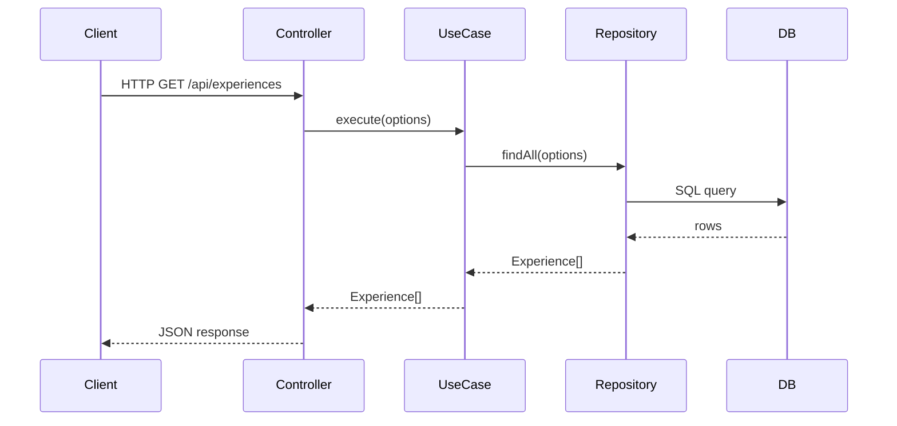
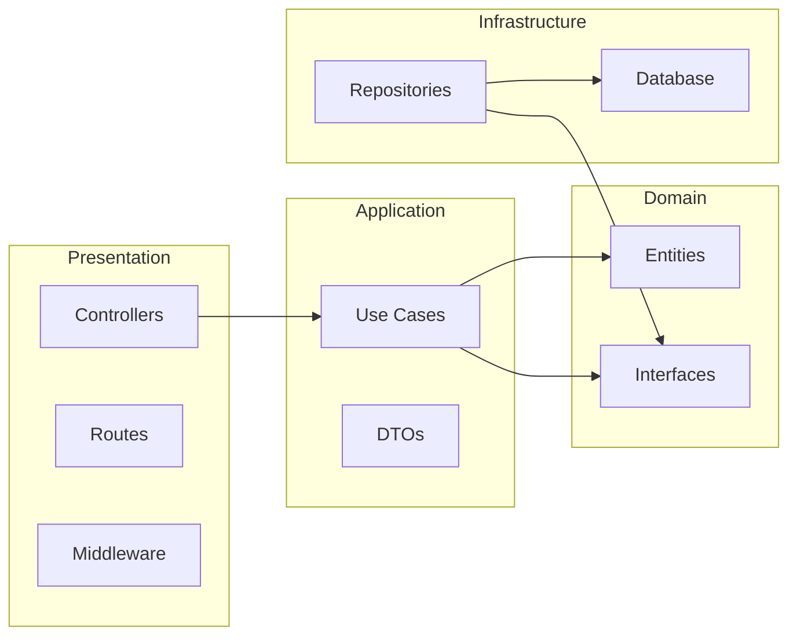

# Architecture Guide

This guide explains the overall architecture of Personal Site v2, focusing on the **Clean Architecture** pattern used in the backend and the component structure of the frontend.

**Table of Contents**
- [Architecture Overview](#architecture-overview)
- [Backend Clean Architecture](#backend-clean-architecture)
- [Data Flow Through Layers](#data-flow-through-layers)
- [Frontend Architecture](#frontend-architecture)
- [Integration Points](#integration-points)
- [Design Decisions & Trade-offs](#design-decisions--trade-offs)

---

## Architecture Overview

Personal Site v2 is a **monorepo** consisting of three independent services:

```
┌─────────────────────────────────────────────────────────┐
│                      Frontend (React)                     │
│              Running on http://localhost:5173             │
└────────┬────────────────────────────────────┬───────────┘
         │ HTTP Requests (Axios)              │
         │ JSON API with JWT Auth             │
         ▼                                    ▼
┌──────────────────────────────┐  ┌──────────────────────┐
│  Backend (Express.js)         │  │  Agent (Express.js)   │
│  Clean Architecture           │  │  Clean Architecture   │
│  Port 3000                    │  │  Port 3001            │
│  ┌────────────────────────┐   │  │  ┌────────────────┐  │
│  │ Auth, Portfolio,       │◄──┼──┼──│ Portfolio Data │  │
│  │ Content, Engagement    │   │  │  │ Service (HTTP) │  │
│  └────────────────────────┘   │  │  └────────────────┘  │
└─────────────┬────────────────┘  │  │                    │
              │                    │  │  ┌────────────────┐  │
              │                    │  └──│ Ollama Service │  │
              │                    │     │ (LLM Inference)│  │
              │                    │     └────────┬───────┘  │
              │                    │              │          │
              ▼                    │              ▼          │
┌─────────────────────────┐       │  ┌──────────────────┐   │
│  PostgreSQL Database    │       │  │ Ollama (External)│   │
│  Port 5432              │       │  │ Port 11434       │   │
└─────────────────────────┘       └──┴──────────────────┴───┘
```

### Service Responsibilities

1. **Frontend** - User interface, presentation logic
2. **Backend** - Portfolio data, authentication, content management
3. **Agent** - Job assessment, conversational engagement via LLM
4. **PostgreSQL** - Persistent data storage
5. **Ollama** - Local LLM inference engine (external dependency)

---

## Backend Clean Architecture

The backend strictly follows **Clean Architecture** principles, ensuring:
- 🔒 **Independence from frameworks** - Can swap Express for another HTTP framework
- 🧪 **Testability** - Business logic is isolated from plumbing
- 📦 **Maintainability** - Clear separation of concerns
- 🔄 **Reusability** - Business logic can be used by different interfaces (HTTP, CLI, events, etc.)

### The Four Layers

Dependencies flow **inward only** — Domain knows nothing about Infrastructure, Presentation, or external frameworks.

```
                    PRESENTATION LAYER
             (HTTP Requests/Responses)
                           ▲
                           │ depends on
                           ▼
                  APPLICATION LAYER
           (Use Cases, Business Rules)
                           ▲
                           │ depends on
                           ▼
                   DOMAIN LAYER
          (Entities, Interfaces, Specs)
                           ▲
                           │ implements
                           ▼
              INFRASTRUCTURE LAYER
           (Databases, External APIs)
```

**Request flow (Mermaid)** – From HTTP request to database and back:



### Layer Breakdown

#### 1. **Domain Layer** (`src/domain/`)
**Responsibility**: Define core business concepts and rules, organized by bounded contexts.

**Bounded Contexts**: The domain is explicitly organized into four bounded contexts following Domain-Driven Design principles:

1. **Portfolio** (`domain/portfolio/`)
   - Entities: `Experience`, `Project`
   - Interfaces: `IExperienceRepository`, `IProjectRepository`
   - Purpose: Professional work history and portfolio projects

2. **Auth** (`domain/auth/`)
   - Entities: `AdminUser`, `SafeAdminUser`
   - Interfaces: `IAdminUserRepository`
   - Purpose: Authentication and administrative access control

3. **Content** (`domain/content/`)
   - Entities: `BlogPost`, `ToolkitCategory`
   - Interfaces: `IBlogPostRepository`, `IToolkitCategoryRepository`
   - Purpose: Content management (blog articles, toolkit items)

4. **Engagement** (`domain/engagement/`)
   - Entities: `ContactSubmission`, `ConsultationSubmission`
   - Interfaces: `IContactSubmissionRepository`, `IConsultationSubmissionRepository`
   - Purpose: User engagement through contact and consultation forms

**Structure**:
```
domain/
├── portfolio/
│   ├── Experience.ts
│   ├── Project.ts
│   ├── IExperienceRepository.ts
│   ├── IProjectRepository.ts
│   └── index.ts
├── auth/
│   ├── AdminUser.ts
│   ├── IAdminUserRepository.ts
│   └── index.ts
├── content/
│   ├── BlogPost.ts
│   ├── ToolkitCategory.ts
│   ├── IBlogPostRepository.ts
│   ├── IToolkitCategoryRepository.ts
│   └── index.ts
├── engagement/
│   ├── ContactSubmission.ts
│   ├── ConsultationSubmission.ts
│   ├── IContactSubmissionRepository.ts
│   ├── IConsultationSubmissionRepository.ts
│   └── index.ts
├── entities/      # Legacy - redirects to bounded contexts
├── interfaces/    # Legacy - redirects to bounded contexts
└── index.ts       # Main exports
```

**Example Structure**:
```typescript
// domain/portfolio/Experience.ts
export interface Experience {
  id: string;
  company: string;
  role: string;
  startDate: Date;
  // ... other fields
}

// domain/portfolio/IExperienceRepository.ts
export interface IExperienceRepository {
  findAll(options?: QueryOptions): Promise<Experience[]>;
  findById(id: string): Promise<Experience | null>;
  create(input: CreateExperienceInput): Promise<Experience>;
  update(id: string, input: UpdateExperienceInput): Promise<Experience>;
  delete(id: string): Promise<void>;
}
```

**Key Rules**: 
- Domain layer imports from NOTHING except other domain files
- Each bounded context is self-contained
- Cross-context dependencies should be avoided at domain level
- Repository interfaces define persistence contracts for each entity

**Layer dependencies (Mermaid)**:



---

#### 2. **Application Layer** (`src/application/`)
**Responsibility**: Orchestrate business logic (use cases) and validate inputs (DTOs).

**Contents**:
- **Use Cases** (`application/use-cases/`): Individual feature implementations
  - Structure: `use-cases/[entity]/[Action][Entity].usecase.ts`
  - Examples:
    - [`GetAllExperiencesUseCase`](../packages/backend/src/application/use-cases/experience) - Fetch all experiences
    - `CreateExperienceUseCase` - Create a new experience
  - **Pattern**: Each use case has one job (Single Responsibility)
  - **Dependency Injection**: Repository injected via constructor
  
- **DTOs** (`application/dtos/`): Input validation schemas using Zod
  - [`experience.dto.ts`](../packages/backend/src/application/dtos/experience.dto.ts): `CreateExperienceSchema`, `UpdateExperienceSchema`
  - **Purpose**: Validate and transform raw HTTP input into type-safe data
  - **Location**: Validation happens here, NOT in controllers

**Example Use Case**:
```typescript
// GetAllExperiencesUseCase - in application/use-cases/experience/
export class GetAllExperiencesUseCase {
  constructor(private repository: IExperienceRepository) {}

  async execute(options?: QueryOptions): Promise<Experience[]> {
    // Business logic: fetch and return experiences
    return this.repository.findAll(options);
  }
}
```

**Example DTO**:
```typescript
// application/dtos/experience.dto.ts
export const CreateExperienceSchema = z.object({
  company: z.string().min(1, 'Company name required'),
  role: z.string().min(1, 'Role required'),
  startDate: z.string().datetime().or(z.date()),
  // ... more fields
});
```

**Key Rule**: Application layer depends on Domain (entities & interfaces) but NOT on Infrastructure or Presentation.

---

#### 3. **Infrastructure Layer** (`src/infrastructure/`)
**Responsibility**: Implement domain interfaces using concrete technologies (Drizzle, databases, APIs).

**Contents**:
- **Repositories** (`infrastructure/repositories/`): Database access implementations
  - Naming: `Drizzle[Entity]Repository.ts`
  - Examples:
    - `DrizzleExperienceRepository` - Implements `IExperienceRepository` using Drizzle
    - `DrizzleProjectRepository` - Implements `IProjectRepository`
  - **Rule**: Must implement the corresponding domain interface
  - **Job**: Convert between domain entities and database records
  
- **Persistence** (`infrastructure/persistence/`): Database configuration
  - [`db.ts`](../packages/backend/src/infrastructure/persistence/db.ts) - Singleton Drizzle client instance
  - [`schema.ts`](../packages/backend/src/infrastructure/persistence/schema.ts) - Table definitions
  - Health checks, connection management

**Example Repository**:
```typescript
// infrastructure/repositories/DrizzleExperienceRepository.ts
export class DrizzleExperienceRepository implements IExperienceRepository {
  async findAll(options?: QueryOptions): Promise<Experience[]> {
    return db
      .select()
      .from(experiences)
      .where(options?.featured ? eq(experiences.featured, true) : undefined)
      .orderBy(desc(experiences.startDate));
  }

  async create(input: CreateExperienceInput): Promise<Experience> {
    const rows = await db.insert(experiences).values(input).returning();
    return rows[0];
  }
  // ... other methods
}
```

**Key Rule**: Infrastructure layer implements domain interfaces. Other layers don't know Drizzle exists.

---

#### 4. **Presentation Layer** (`src/presentation/`)
**Responsibility**: Handle HTTP requests/responses, route validation, middleware orchestration.

**Contents**:
- **Controllers** (`presentation/controllers/`): HTTP endpoint handlers
  - One controller per domain entity: `experience.controller.ts`, `auth.controller.ts`
  - **Pattern**: Receive HTTP request → validate input with DTO → instantiate repository & use case → call use case → return response
  - **Job**: Convert HTTP requests to domain operations and back
  
- **Routes** (`presentation/routes/`): Express route definitions
  - Map HTTP verbs + paths to controller methods
  - Apply middleware (auth, rate limiting)
  - Example: `POST /experiences` (auth required) → `controller.create()`
  
- **Middleware** (`presentation/middleware/`): Cross-cutting concerns
  - `authMiddleware` - JWT token validation
  - `errorHandler` - Global error handling
  - `rateLimiter` - Request rate limiting

**Example Controller**:
```typescript
// presentation/controllers/experience.controller.ts
export class ExperienceController {
  private repository = new DrizzleExperienceRepository();

  async create(req: Request, res: Response, next: NextFunction): Promise<void> {
    try {
      // 1. Validate input with DTO schema
      const validatedData = CreateExperienceSchema.parse(req.body);
      
      // 2. Instantiate use case with repository
      const useCase = new CreateExperienceUseCase(this.repository);
      
      // 3. Execute business logic
      const experience = await useCase.execute(validatedData);
      
      // 4. Return HTTP response
      res.status(201).json({ success: true, data: experience });
    } catch (error) {
      next(error);  // Pass to error handler middleware
    }
  }
}
```

**Example Route**:
```typescript
// presentation/routes/experience.routes.ts
const router = Router();
const controller = new ExperienceController();

// Public: GET /api/experiences
router.get('/', (req, res, next) => controller.getAll(req, res, next));

// Protected: POST /api/experiences (requires JWT)
router.post('/', authMiddleware, (req, res, next) => controller.create(req, res, next));
```

**Key Rule**: Presentation layer orchestrates, doesn't contain business logic.

---

## Data Flow Through Layers

Here's a **concrete example** of how a request flows through the architecture:

### Request: Create a new experience (POST /api/experiences)

Step-by-step flow:

```
1. HTTP REQUEST arrives
   POST /api/experiences
   Body: { company: "ACME Corp", role: "Engineer", ... }

2. PRESENTATION LAYER (experience.routes.ts)
   ↓ Router matches route to controller method

3. PRESENTATION LAYER (experience.controller.ts)
   ├─ Validate input with CreateExperienceSchema (DTO)
   │  └─> Throws ValidationError if invalid
   ├─ Instantiate: new DrizzleExperienceRepository()
   ├─ Instantiate: new CreateExperienceUseCase(repository)
   └─ Call: useCase.execute(validatedData)

4. APPLICATION LAYER (CreateExperienceUseCase)
   ├─ Receives validated { company, role, ... }
   ├─ Contains business logic (if any)
   └─ Calls: this.repository.create(input)

5. DOMAIN LAYER (IExperienceRepository interface)
   └─ Defines contract that repository must fulfill

6. INFRASTRUCTURE LAYER (DrizzleExperienceRepository)
   ├─ Create database record
   └─ Return: Experience object

7. APPLICATION LAYER → returns to use case
8. PRESENTATION LAYER → converts to HTTP response
9. HTTP RESPONSE sent back to client
   { success: true, data: { id: 1, company: "ACME Corp", ... } }
```

**Key insights**:
- Each layer has a single responsibility
- Dependencies point inward only (Presentation → Application → Domain ← Infrastructure)
- Business logic (steps 2-5) is separate from plumbing (HTTP, database)
- Easy to test: mock the repository, test the use case in isolation

---

## Agent Service Architecture

The **Agent service** is an independent Express.js microservice that handles AI-powered job assessment and conversational engagement functionality. Like the Backend, it follows Clean Architecture principles but with different bounded contexts.

### Service Overview

```
Agent Service (Port 3001)
├── Domain Layer
│   ├── Assessment (JobFitAssessment, CandidateStrength)
│   └── Conversation (ConversationMessage, Session)
├── Application Layer
│   ├── Use Cases
│   │   ├── AssessJobFit
│   │   └── EngageInConversation
│   └── DTOs (Zod validation schemas)
├── Infrastructure Layer
│   ├── OllamaService (LLM inference)
│   ├── ConversationSessionManager (in-memory sessions)
│   └── PortfolioDataService (HTTP client to Backend)
└── Presentation Layer
    ├── Controllers (assessment.controller.ts)
    └── Routes (/api/assess/*)
```

### Agent-Specific Bounded Contexts

The Agent service operates within two primary bounded contexts:

1. **Assessment Context** - Job fit evaluation using LLM analysis
   - Entities: `JobFitAssessment`, `CandidateStrength`
   - Use Cases: `AssessJobFit`, `EngageInConversation`
   - External Dependencies: Ollama (neural-chat 13B model), Backend portfolio API

2. **Conversation Context** - Session management for multi-turn dialogue
   - Entities: `ConversationMessage`, `ConversationSession`
   - Infrastructure: `ConversationSessionManager` (in-memory with 30-min TTL)
   - Privacy: No database storage - sessions expire and are garbage collected

### External Dependencies

#### 1. **Ollama (Port 11434)**
- **Purpose**: Local LLM inference engine running neural-chat (13B parameters)
- **Usage**: Agent sends prompt + conversation history → receives assessment response
- **Deployment**: Runs on separate home server (requires 8GB+ RAM)
- **Communication**: HTTP API calls to `http://localhost:11434/api/generate`

#### 2. **Backend API (Port 3000)**
- **Purpose**: Fetch candidate portfolio data (experiences, projects)
- **Usage**: `PortfolioDataService` makes HTTP requests to Backend's public API endpoints
- **Endpoints Used**:
  - `GET /api/experiences` - Work history
  - `GET /api/projects` - Portfolio projects
- **Authentication**: Not required for public portfolio data

### Data Flow Example: Job Assessment

```
1. Frontend sends POST /api/assess/job-fit
   Body: { jobDescription: "...", sessionId?: "..." }

2. PRESENTATION LAYER (assessment.controller.ts)
   ├─ Validate input with AssessJobFitSchema (DTO)
   └─ Call: useCase.execute(jobDescription, sessionId)

3. APPLICATION LAYER (AssessJobFitUseCase)
   ├─ Fetch portfolio data via PortfolioDataService
   ├─ Retrieve conversation history (if sessionId provided)
   └─ Call: ollamaService.assessJobFit(...)

4. INFRASTRUCTURE LAYER (OllamaService)
   ├─ Build prompt with evaluation criteria
   ├─ Include conversation history for context
   ├─ Send HTTP POST to Ollama at port 11434
   └─ Parse LLM response into JobFitAssessment structure

5. INFRASTRUCTURE LAYER (ConversationSessionManager)
   ├─ Create new session (if none provided)
   ├─ Add exchange to session history
   └─ Return sessionId for next turn

6. PRESENTATION LAYER → returns to controller
7. HTTP RESPONSE sent back to Frontend
   {
     success: true,
     data: {
       fitScore: 85,
       fit: true,
       strengths: [{ title: "...", description: "..." }],
       gaps: ["..."],
       recommendation: "...",
       sessionId: "abc-123"
     }
   }
```

### Key Design Decisions

| Decision | Rationale | Trade-off |
|----------|----------|-----------|
| **Separate service** | Assessment is independent bounded context | Additional service to deploy |
| **In-memory sessions** | Privacy requirement (no database) | Sessions don't survive service restart |
| **30-minute TTL** | Balance UX vs. memory usage | User must complete conversation within window |
| **HTTP to Backend** | Loose coupling, service independence | Network latency for portfolio data |
| **External Ollama** | Agent doesn't own LLM lifecycle | Dependency on external service availability |

### Session Management Details

Conversation sessions are managed entirely in-memory:

```typescript
// Session structure
{
  sessionId: "uuid-v4",
  messages: [
    { role: "system", content: "You are..." },
    { role: "user", content: "Job description: ..." },
    { role: "assistant", content: "Assessment: ..." }
  ],
  createdAt: Date,
  expiresAt: Date  // createdAt + 30 minutes
}
```

**Cleanup**: Background task runs every 5 minutes, removes expired sessions.

**Limits**: Maximum 21 messages per session (10 exchanges + 1 system prompt) to prevent memory bloat.

---

## Frontend Architecture

The frontend is structured as a **component-driven React SPA** with clear separation of concerns:

```
src/
├── pages/              # Page-level components (routed)
│   ├── [PageName]/
│   │   ├── index.tsx     # Page component
│   │   └── components/   # Page-specific sub-components
│   └── ...
├── features/           # Modular feature code (e.g., auth, projects)
│   ├── shared/         # Shared feature utilities
│   └── [feature]/      # Feature folder (hooks, components, services)
├── components/         # Shared UI components
│   ├── common/         # Generic (Button, Card, etc.)
│   └── layout/         # Layout (Header, Sidebar, etc.)
├── design-system/      # Design system (tokens, base styles)
│   ├── components/     # Design system components
│   ├── tokens/         # Color, spacing, typography values
│   └── styles/         # Global styles, CSS utilities
├── core/               # Core application infrastructure
│   ├── api/            # Axios client with interceptors
│   ├── router/         # React Router v7 configuration
│   ├── providers/      # Context providers (Auth, Theme, etc.)
│   └── store/          # Zustand stores (global state)
├── hooks/              # Custom React hooks
├── utils/              # Utilities (cn, validators, formatting)
└── services/           # (Legacy) - prefer `core/api` for new code
```

### Key Frontend Patterns

#### 1. **API Communication** (`core/api/`)
- **Client**: Axios instance with request/response interceptors
- **Interceptors**: Add JWT tokens to requests, handle 401 errors
- **Error handling**: Failed requests trigger toast notifications
- **Query**: TanStack Query (React Query) for server state management

#### 2. **State Management** (`core/store/`)
- **Global state**: Zustand stores (e.g., `useAuthStore`)
- **Component state**: React hooks (`useState`, `useReducer`)
- **Server state**: TanStack Query for API data caching

#### 3. **Routing** (`core/router/`)
- **Framework**: React Router v7
- **Route definitions**: Centralized configuration with page imports
- **Protected routes**: Check auth token before rendering admin pages

#### 4. **Type Safety**
- **TypeScript strict mode**: No `any` types
- **Zod for validation**: Match backend DTO schemas
- **Axios response typing**: Explicit API response types

---

## Integration Points

### Frontend ↔ Backend Communication

#### 1. **API Client Setup** (in `core/api/client.ts`)
```typescript
// Axios instance configured with:
// - Base URL: http://localhost:3000/api
// - Request interceptor: Adds "Authorization: Bearer <token>"
// - Response interceptor: Handles 401, shows error toasts
```

#### 2. **Authentication Flow**
```
User clicks "Login" button
    ↓
Frontend sends POST /api/auth/login
    ↓
Backend validates credentials, returns JWT token
    ↓
Frontend stores token in Zustand store (useAuthStore)
    ↓
Subsequent requests automatically include token via interceptor
    ↓
Protected backend endpoints verify JWT, reject if invalid
```

#### 3. **Data Fetching** (TanStack Query)
```typescript
// Example: Fetch all experiences
const { data: experiences, isLoading } = useQuery({
  queryKey: ['experiences'],
  queryFn: async () => {
    const res = await apiClient.get('/experiences');
    return res.data.data;  // API response: { success: true, data: [...] }
  }
});
```

#### 4. **Error Handling**
- **Backend** sends: `{ success: false, error: "message" }`
- **Frontend** receives, shows toast: `"Error message"`
- **401 responses** trigger logout and redirect to login

---

## Design Decisions & Trade-offs

### ✅ Why Clean Architecture?

| Aspect | Benefit |
|--------|---------|
| **Testability** | Use cases testable without database/HTTP |
| **Flexibility** | Swap Drizzle for raw SQL without changing business logic |
| **Scalability** | Add new controllers/repositories without modifying domain |
| **Communication** | New developers quickly understand layer responsibilities |

### Trade-offs

| Choice | Why | Cost |
|--------|-----|------|
| **Repository per entity** | Clear boundaries, easier to find code | More files to maintain |
| **DTO validation in Application layer** | Validates before business logic | Slightly more upfront validation (worth it) |
| **Use case per action** | Single Responsibility | More classes (but clearer intent) |
| **Monorepo** | Shared code, single deployment | More complex setup initially |

### Why PostgreSQL + Prisma?

- **PostgreSQL**: Reliable, open-source, great for relational data
- **Drizzle**: Type-safe SQL query builder, lightweight, excellent TypeScript support. See [ADR-003](./ADR/0003-drizzle-orm-migration.md)

---

## Next Steps

- **Adding a feature?** See [Feature Development Guide](./FEATURE_DEVELOPMENT.md)
- **Want API details?** See [API Reference](./API_REFERENCE.md)
- **Deploying?** See [Deployment Guide](./DEPLOYMENT.md)
- **Questions about a specific layer?** Ask team or check layer folder's `index.ts`

---

**Last Updated**: February 2026  
**Architecture Pattern**: Clean Architecture (Hexagonal/Onion)  
**Backend Framework**: Express.js  
**Frontend Framework**: React 19
